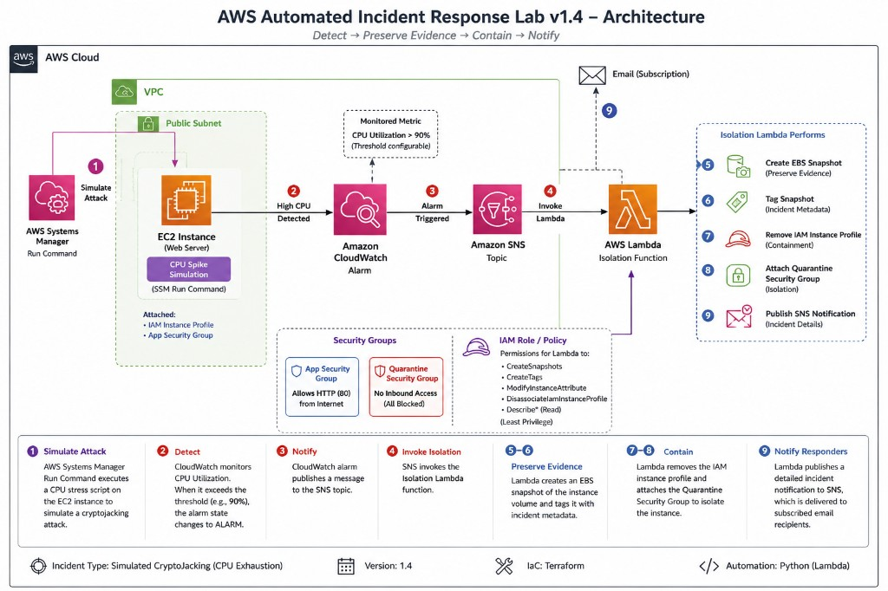

# AWS EC2 Incident Response Isolation Lab (v1.4)

A beginner-friendly Terraform project for practicing EC2 incident response isolation. Deploy a small lab in `us-east-1`, simulate a cryptojacking/resource exhaustion incident, and let CloudWatch + SNS automatically trigger isolation.

## What this lab does

### v1.0 (manual isolation)

- Creates a VPC with a public subnet, internet gateway, route table, and association
- Launches one Amazon Linux EC2 instance with a normal security group (SSH from your IP, HTTP from anywhere)
- Creates a quarantine security group with no inbound or outbound rules
- Provides an isolation Lambda that accepts an EC2 instance ID and quarantines the instance

### v1.4 (automated cryptojacking simulation)

- Adds a **simulator Lambda** that uses **SSM Run Command** to start a temporary CPU stress workload
- Adds a **CloudWatch CPU alarm** tuned for lab testing
- Publishes alarm state changes to **SNS**
- Configures SNS to invoke the **isolation Lambda**
- Enhances isolation to:
  1. Create tagged **EBS snapshots** of all attached volumes
  2. Remove the IAM instance profile
  3. Attach the quarantine security group
  4. Publish a detailed SNS notification

Manual isolation still works with:

```json
{
  "instance_id": "i-0123456789abcdef0"
}
```

## Architecture

**AWS Automated Incident Response Lab v1.4** — Detect → Preserve Evidence → Contain → Notify



### Workflow summary

1. Operator invokes simulator Lambda
2. Simulator Lambda runs a short CPU burn loop on the EC2 instance via SSM
3. EC2 CPU utilization rises
4. CloudWatch alarm enters `ALARM`
5. SNS invokes isolation Lambda
6. Isolation Lambda creates tagged EBS snapshots, removes IAM profile, attaches quarantine SG, and notifies SNS
7. Email subscribers receive the incident details

## Prerequisites

Before you deploy, make sure you have:

1. **Terraform** >= 1.5 installed
2. **AWS CLI** installed and configured
3. **AWS credentials** with permission to create VPC, EC2, IAM, Lambda, SNS, CloudWatch, and SSM resources

### Configure AWS credentials

```powershell
aws configure
```

Use `us-east-1` as the default region.

Verify credentials:

```powershell
aws sts get-caller-identity
```

## Project files

| File | Purpose |
|------|---------|
| `main.tf` | Networking, EC2, IAM, SNS, CloudWatch alarm, and Lambda resources |
| `variables.tf` | Input variables |
| `outputs.tf` | Useful values after deployment |
| `lambda_function.py` | Isolation handler code |
| `simulator_lambda.py` | CPU stress simulator handler code |

## Deploy the lab

From this project directory:

```powershell
terraform init
terraform plan
terraform apply
```

After apply completes:

```powershell
terraform output
```

Terraform also creates a private key file named `ir-isolation-lab-key.pem` in this directory.

### Subscribe to SNS notifications

Email subscriptions require manual confirmation:

```powershell
aws sns subscribe `
  --topic-arn (terraform output -raw sns_topic_arn) `
  --protocol email `
  --notification-endpoint you@example.com
```

Check your inbox and confirm the subscription.

## v1.4 test plan

1. Run `terraform apply`
2. Confirm EC2 starts with the app SG and IAM instance profile
3. Confirm SNS email subscription if configured manually
4. Invoke the simulator Lambda
5. Watch CloudWatch CPU metric rise
6. Confirm CloudWatch alarm enters `ALARM`
7. Confirm SNS triggers the isolation Lambda
8. Confirm EBS snapshot exists with incident tags
9. Confirm IAM instance profile is removed
10. Confirm quarantine SG is attached
11. Confirm HTTP access fails
12. Confirm SNS email contains incident details
13. Run `terraform destroy`
14. Verify all lab resources are removed

## Verify the instance before the incident

### Test HTTP

```powershell
curl http://<ec2_public_ip>
```

You should see HTML containing `IR Isolation Lab`.

### Confirm SSM is online

Wait a few minutes after apply, then check:

```powershell
aws ssm describe-instance-information `
  --filters "Key=InstanceIds,Values=$(terraform output -raw ec2_instance_id)"
```

The instance should appear as `Online` before you invoke the simulator.

## Invoke the simulator Lambda

### AWS Console

1. Open **Lambda**
2. Select `terraform output -raw simulator_lambda_name`
3. Create a test event like `{}` or:

```json
{
  "instance_id": "i-0123456789abcdef0"
}
```

4. Run the test

### AWS CLI

```powershell
$functionName = terraform output -raw simulator_lambda_name

aws lambda invoke `
  --function-name $functionName `
  --payload "{}" `
  simulator-out.json

Get-Content simulator-out.json
```

The simulator starts a safe CPU stress loop for about 6 minutes by default.

## Watch the automated response

### CloudWatch CPU metric

1. Open **CloudWatch** -> **Metrics** -> **EC2** -> **Per-Instance Metrics**
2. Select `CPUUtilization` for the lab instance
3. Confirm utilization rises after the simulator runs

### CloudWatch alarm

Open the alarm named in:

```powershell
terraform output cloudwatch_alarm_name
```

It should move to `ALARM` after sustained high CPU.

### Isolation Lambda logs

Open CloudWatch Logs for:

```powershell
terraform output isolation_lambda_name
```

Confirm snapshot creation, IAM profile removal, and quarantine SG attachment.

## Manual isolation path (still supported)

You can still invoke isolation manually:

```json
{
  "instance_id": "i-0123456789abcdef0"
}
```

The isolation Lambda also accepts SNS alarm payloads and falls back to the `TARGET_INSTANCE_ID` environment variable when needed.

### AWS CLI

```powershell
$instanceId = terraform output -raw ec2_instance_id
$functionName = terraform output -raw isolation_lambda_name

aws lambda invoke `
  --function-name $functionName `
  --payload "{\"instance_id\":\"$instanceId\"}" `
  out.json

Get-Content out.json
```

## Verify isolation worked

After automated or manual isolation:

1. **HTTP should fail**

   ```powershell
   curl http://<ec2_public_ip>
   ```

2. **EC2 Console checks**
   - Only the quarantine security group is attached
   - The IAM instance profile is removed

3. **EBS snapshots**
   - Open **EC2** -> **Snapshots**
   - Look for snapshots tagged with:
     - `Incident=true`
     - `IncidentType=SimulatedCryptoJacking`
     - `CreatedBy=IncidentResponseLab`

4. **SNS notification**
   - Email should include incident type, instance ID, snapshot IDs, IAM result, quarantine SG ID, timestamp, and final status

## Restore normal access (optional)

To run the lab again without destroying everything:

- Run `terraform apply` to restore the app SG and IAM instance profile, or
- Re-attach them manually in the EC2 console

If the instance is already quarantined, you may need to restore networking before SSM works again.

## Cleanup

When you are finished practicing:

```powershell
terraform destroy
```

Type `yes` when prompted.

You can also delete local generated files if they remain:

- `ir-isolation-lab-key.pem`
- `lambda_function.zip`
- `simulator_lambda.zip`

## Cost note

If left running, the main cost is the EC2 instance (`t3.micro`, roughly $8-10/month outside free tier). EBS snapshots created during isolation also incur small storage cost until deleted. Destroy resources when you are done.

## Lab limitations

- Isolation is for containment practice, not full forensic preservation
- The Lambda replaces all security groups on the target instance
- SSH access depends on detecting your current public IP at apply time
- SNS email subscriptions require manual confirmation
- The simulator uses temporary CPU stress only; it is not real malware
- Automated isolation may take 1-2 minutes after the simulator starts due to CloudWatch alarm timing

## Troubleshooting

| Issue | Fix |
|-------|-----|
| `terraform plan` fails with credential errors | Run `aws configure` and verify with `aws sts get-caller-identity` |
| Simulator fails with SSM error | Wait for SSM agent to come online; confirm instance has IAM SSM permissions |
| Alarm never enters `ALARM` | Confirm simulator ran; check CPU metric; lower threshold in variables if needed |
| Isolation Lambda permission error | Re-run `terraform apply`; check CloudWatch Logs |
| No SNS email received | Confirm the subscription in your inbox |
| HTTP still works after isolation | Refresh EC2 console; confirm quarantine SG is attached |
